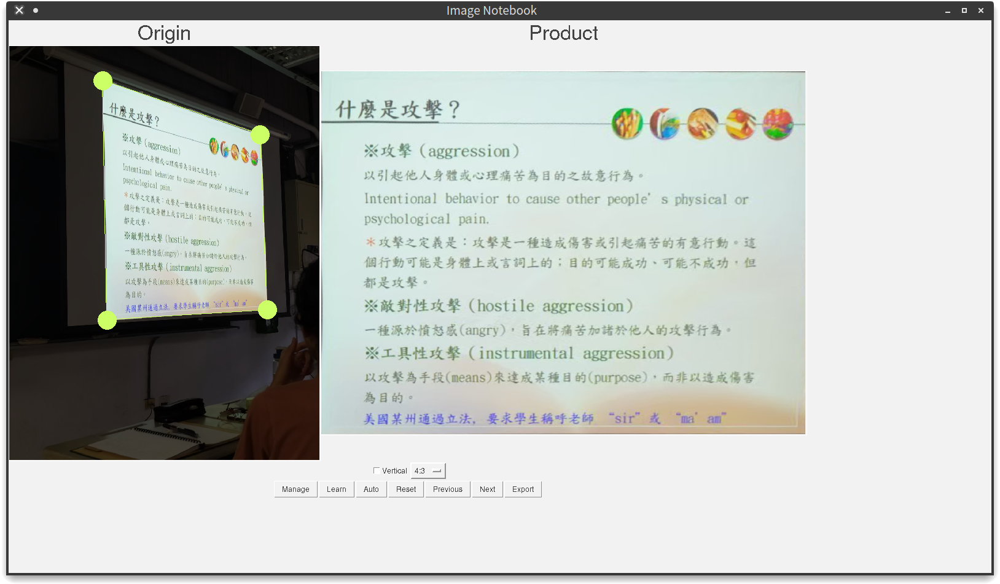

# ImageNotebook

> 最好的上課簡報轉正工具



[Example Video](https://youtu.be/o_k1u1SNilg)

## 安裝

需要 Python 3.7 以上版本，系統需要安裝 python-tk。

Clone the repo:
```
git clone https://github.com/lancatlin/image-notebook.git
```

安裝依賴：

```
pip install -r requirements.txt
```

執行：

```
python main.py
```
